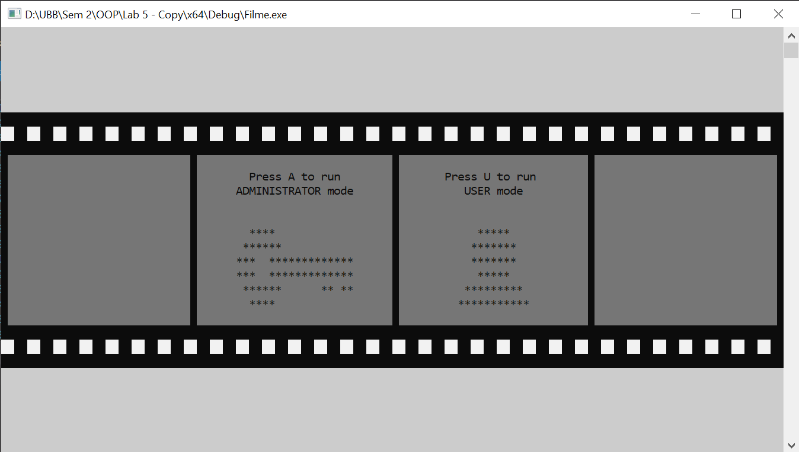
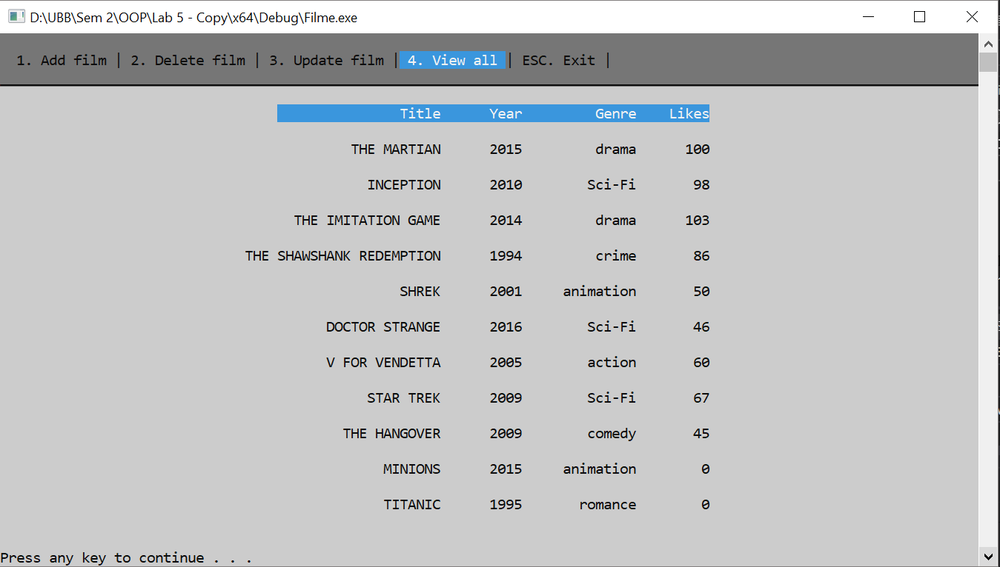
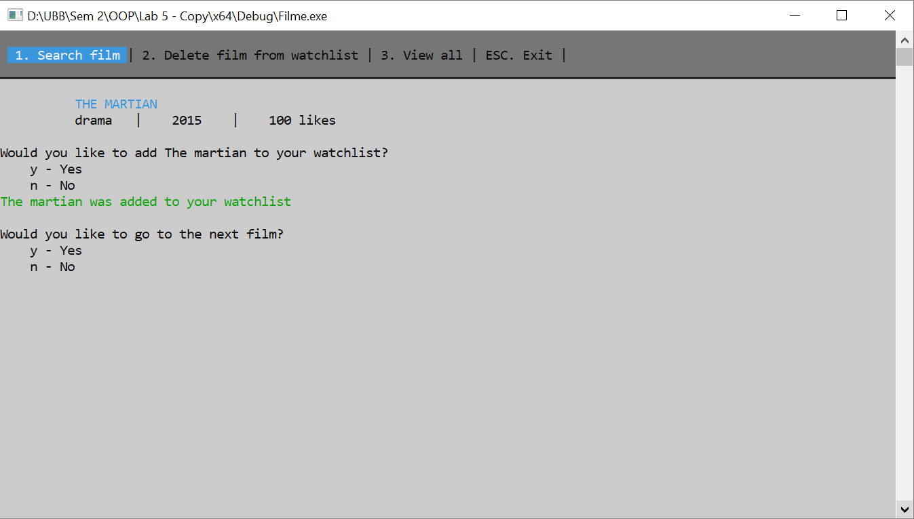
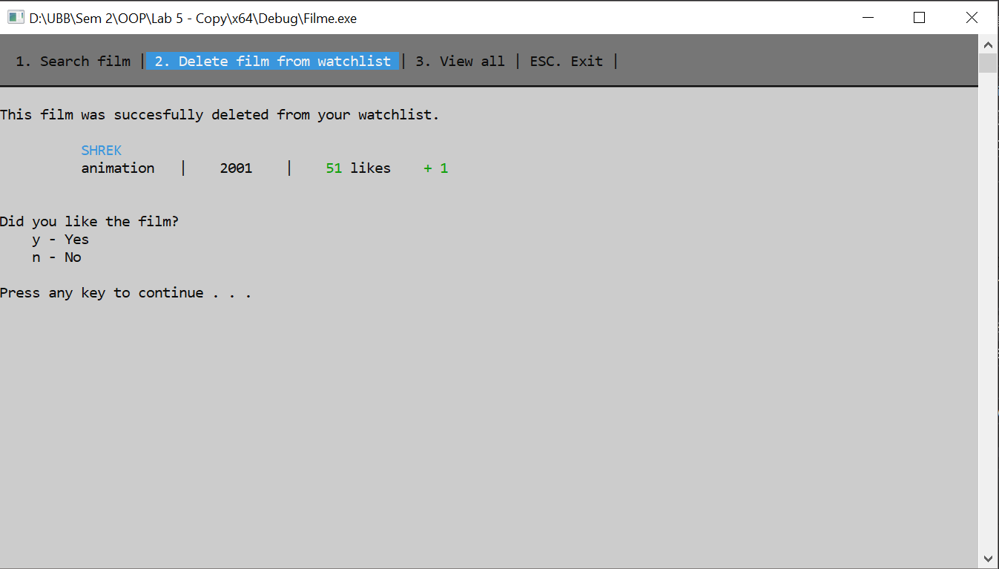

# Movie recommendation

🎞️ C++ Uni Assignment

## Features
#### Administrator mode
* CRUD  operations
* View movie list

#### User mode
* Search for movies of a specific genre (movie trailers are opened in a browser)
* Add movies to the User watchlist
* Delete movies from watchlist with the option of rating the movie
* View User watchlist in CSV or HTML format

## Demo

Choose between Administrator and User modes.

Administrator mode: View movie list, Add, Delete or Update it.

User mode: view and manage your watchlist.

